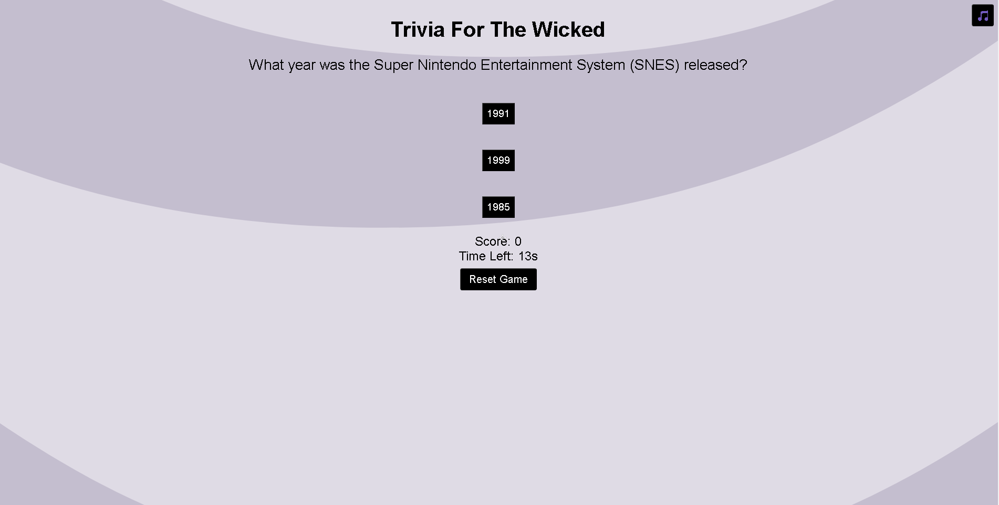

# Trivia for the Wicked 
## My game is built around my love for games. I used to play trivia games as a kid and always loved playing them. The categories and such are built around video game knowledge and other sorts of things.You have 3 guesses to win the game but if you do not get 3 you will lose.

# [Game](https://triviaforthewicked.netlify.app/)

# Attributions
## Planning Materials - [Planning](https://docs.google.com/document/d/1wTY9o-4_6qh_gyPpRZdtZpVKySACTnxwe5xcajbiKYE/edit)
## Reference Help - [Tool](https://developer.mozilla.org/en-US/ )
## Questions I Used - [Questions](https://icebreakerideas.com/video-game-trivia/ )
## Sound Effects - [FreeSound](https://freesound.org/)
## Favicon - [Edit-images](https://www4.lunapic.com/editor/?action=quick-upload)

# Technologies Used
## JavaScript CSS Flexbox HTML Git/Github

# Next steps
## Add more design features such as a score tracker API that lists all of the users scores. I want to change the buttons to images as well as add sounds and more art to bring more of a relaxing feeling.